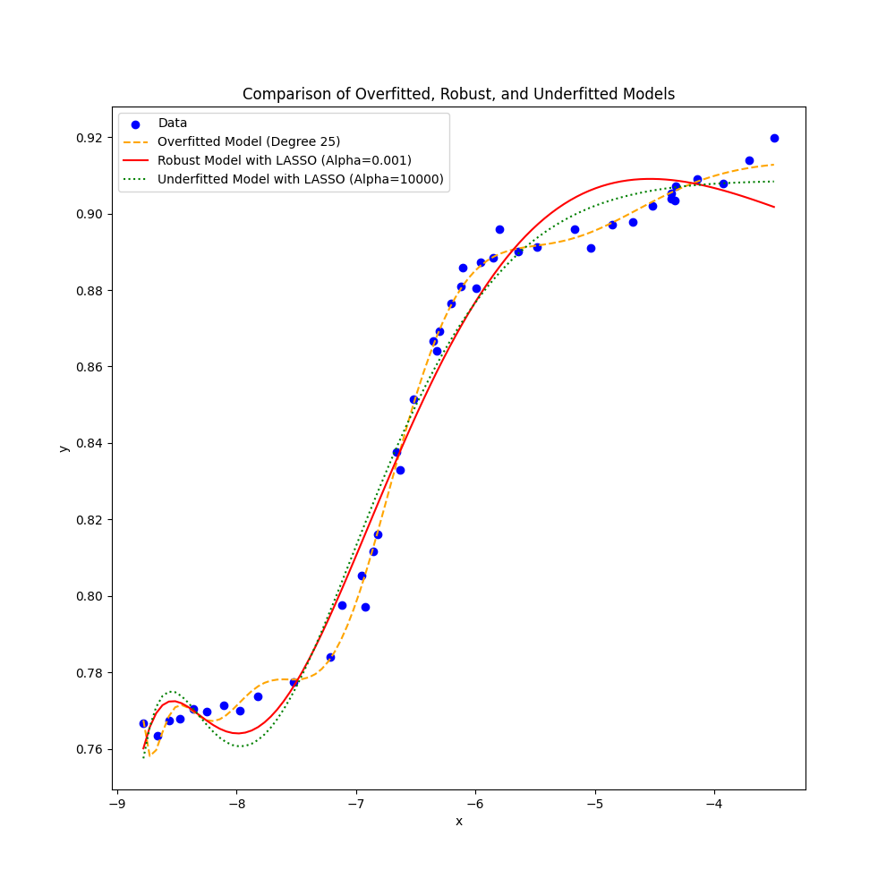

## Project Overview

This project demonstrates the concepts of model complexity, overfitting, and underfitting in linear regression. By using polynomial regression and LASSO regularization, we explore how to balance model complexity and performance. The project includes creating an overfitted model with high-degree polynomial regression, a robust model with moderate regularization, and an underfitted model with strong regularization.

### Objectives

1. Obtain a highly complex model (overfitted model) using higher-order terms in polynomial regression.
2. Gradually reduce model complexity using LASSO regularization to get a robust model.
3. Further reduce model complexity to a first-degree polynomial, resulting in an underfitted model.

### Resources

- **Article**: [Linear Regression with Higher-Order Terms](https://data-sorcery.org/2009/06/04/linear-regression-with-higher-order-terms/)
- **Data Set**: [NIST Linear Regression Data - Filip Dataset](https://www.itl.nist.gov/div898/strd/lls/data/Filip.shtml)

---

## Project Structure

- `data.csv` - Contains the dataset used for training and evaluation.
- `LR.py` - Python script for data loading, model training, and evaluation.

## Setup Instructions

1. **Clone the repository**:

   ```bash
   git clone https://github.com/eniomaiale1/ml-linear-regression.git
   cd ml-linear-regression
   ```

2. **Install dependencies**:

   ```bash
   pip install -r requirements.txt
   ```

3. **Run the project**:
   ```bash
   python3 LR.py
   ```

## Steps to Follow

1. **Create an Overfitted Model**:

   - Use a high-degree polynomial regression (using `sklearn.preprocessing.PolynomialFeatures`).
   - Observe how the model overfits the dataset.

2. **Use LASSO for Regularization**:

   - Apply LASSO regression (using `sklearn.linear_model.Lasso`) to gradually remove the higher-order terms.
   - Monitor the model’s performance and complexity.

3. **Create an Underfitted Model**:
   - Use LASSO regression with strong regularization to achieve an underfitted (almost linear) model.
   - Observe how the model underfits the dataset.

## Results and Analysis

### Overfitted Model

The overfitted model uses a high-degree polynomial regression (degree = 25). This model captures the noise in the dataset, resulting in a very complex model that fits the training data almost perfectly. However, this comes at the cost of poor generalization to new data.

- **Mean Squared Error (MSE)**: The MSE on the training data is very low, but it is expected to be high on unseen data due to overfitting.
- **Complexity**: The model is highly complex with many polynomial terms.
- **Interpretability**: The model is difficult to interpret due to the high number of terms.

### Robust Model

The robust model uses LASSO regression with moderate regularization (alpha = 0.001). This model balances the complexity and performance by removing some of the higher-order terms, resulting in a model that generalizes better to new data.

- **Mean Squared Error (MSE)**: The MSE is higher on the training data compared to the overfitted model but is expected to be lower on unseen data.
- **Complexity**: The model is less complex than the overfitted model due to the regularization.
- **Interpretability**: The model is more interpretable than the overfitted model.

### Underfitted Model

The underfitted model uses LASSO regression with strong regularization. This model is almost linear and does not capture the underlying patterns in the data well, resulting in underfitting.

- **Mean Squared Error (MSE)**: The MSE is high on both the training data and unseen data due to underfitting.
- **Complexity**: The model is very simple with few terms.
- **Interpretability**: The model is highly interpretable due to its simplicity.

### Visualization

The following plots illustrate the differences between the overfitted, robust, and underfitted models:

1. **Overfitted Model**: Shows a highly complex curve that fits the training data almost perfectly.
2. **Robust Model**: Shows a smoother curve that balances complexity and performance.
3. **Underfitted Model**: Shows a nearly linear curve that fails to capture the underlying patterns in the data.

These visualizations help in understanding the trade-offs between model complexity, performance, and interpretability.



## Acknowledgments

- [NIST](https://www.nist.gov/) for the dataset.
- [Data Sorcery](https://data-sorcery.org/) for the linear regression tutorial.
